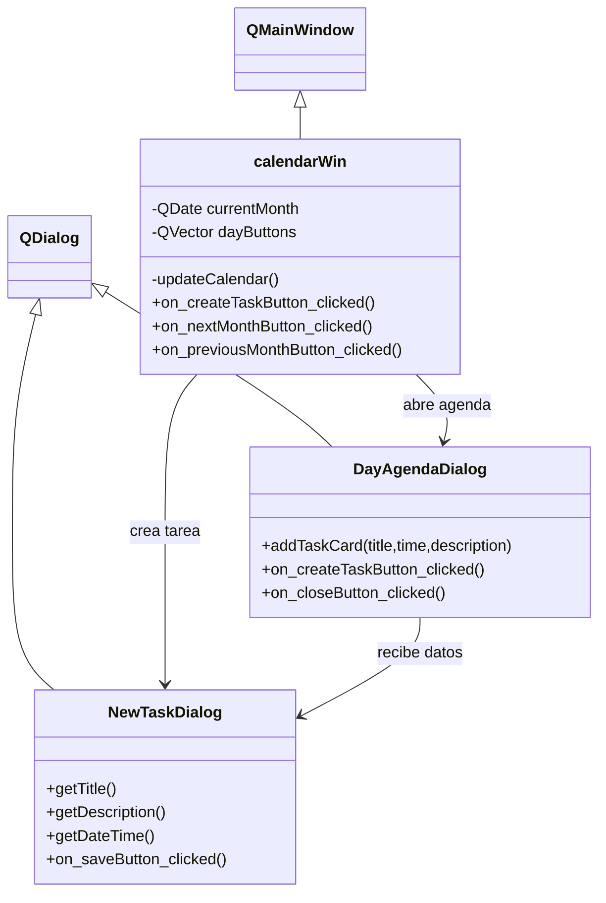

# EntregaIndividual
Interfaz de calendario en Qt

Codigo en funcionamiento:

#Calendario:

  
 

#Funcionamiento del boton de next:

  
 

#Funcionamiento del boton de previous:

  
 

#Interfaz de cada dia al hacer click en cualquier dia.

  

 

#Interfaz de ventana de crear tarea al hacer click:

Esta ventana aparece ya sea abierta por el boton de crear tarea en la ventana principal del calendario o en la ventana de dia (dialog).  

 

Argumentacion;

La herencia se utilizó para especializar las ventanas de la interfaz gráfica proporcionadas por Qt. La clase calendarWin hereda de QMainWindow, mientras que DayAgendaDialog y NewTaskDialog heredan de QDialog. Gracias a esto, las clases desarrolladas reutilizan funcionalidades ya implementadas por Qt, como la gestión de ventanas, eventos y controles gráficos, permitiendo concentrar el desarrollo en la lógica específica del calendario y la gestión de tareas.

Modificadores de acceso

Se emplearon modificadores de acceso para encapsular la información interna de las clases. Los atributos como ui, currentMonth y dayButtons fueron declarados como privados para evitar modificaciones directas desde otras partes del programa. Por otro lado, los métodos que deben ser accesibles desde otras clases, como los constructores y algunos métodos de consulta, fueron declarados públicos. Esto mejora la seguridad y el mantenimiento del código al controlar el acceso a los datos internos.

Sobrecarga y sobreescritura de métodos

En el proyecto se utiliza la sobreescritura de métodos al redefinir los destructores de las clases derivadas (~calendarWin, ~DayAgendaDialog y ~NewTaskDialog) para realizar la liberación adecuada de recursos asociados a cada ventana. Además, se aprovecha la infraestructura de Qt, donde muchos métodos virtuales de las clases base pueden ser redefinidos por las clases derivadas cuando sea necesario.

Polimorfismo

El polimorfismo se utiliza de manera implícita a través del framework Qt. Las clases desarrolladas son tratadas como objetos de sus clases base (QMainWindow y QDialog), permitiendo que Qt gestione las ventanas mediante referencias o punteros a estas clases generales. Esto facilita la integración de las ventanas personalizadas dentro del sistema de interfaces gráficas de Qt.

Reflexión:

Aprendi muchas cosas sobre C++ uy el ambiente detrabajo de un progamador, le batalle mucho, pero me esforce mucho mas. Esta experiencia me ayudo para muchas cosas, me dejo muchos aprendizajes academicos, pero tambien me hizo reflexionar sobre mi futuro academico y profesional.

